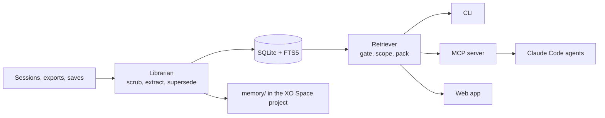
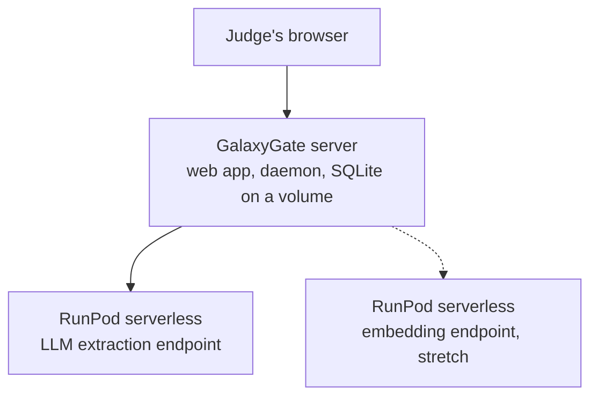

# Vault

Local memory that follows you across every AI model and agent.

Vault reads your AI conversations, turns them into durable facts about your projects and your life, and hands the smallest useful slice back to whatever model or agent you use next. It runs on your machine, writes into the memory folder of an XO Space project so every run is visible, and never copies a chat into a shared folder.

Built at the Coffee & Code AI Agent Hackathon, Philadelphia, September 20, 2026.

## The problem

Every model and every agent forgets you. ChatGPT, Claude, Gemini, Cursor, Claude Code and local models each keep their own memory, and none of them share. People re-explain their projects, preferences and decisions in every new session. Agents repeat work they finished yesterday.

The usual fixes make it worse. Pasting everything costs thousands of tokens per prompt. Retrieval over raw chat logs pulls the wrong project, mixes in things you never wanted shared, and returns five versions of a fact that changed three times.

## The solution

A librarian, not a filing cabinet. Vault structures memory at write time, so retrieval is a lookup instead of a search through noise.

1. Capture. AI conversations (Claude Code sessions, ChatGPT and Claude exports, Markdown transcripts) and explicit saves. No keyboard hooks, no screen capture, ever.
2. Librarian. Scrub secrets, extract facts, entities and an episode summary with a fixed JSON schema, resolve entities against a catalog, and supersede stale facts instead of duplicating them.
3. Store. One SQLite file with FTS5, plus a Markdown mirror into the project's memory/ folder.
4. Retrieve. A gate that skips memory when the prompt does not need it, a hard scope filter (one project at a time), a token budget packer, and a log of exactly what was sent.
5. Inject. A CLI, an MCP server for Claude Code and any other agent, and a web app.

Two rules carry most of the value:

- Supersession. When a fact changes, the old row is marked superseded by the new one. "Team = search" becomes "team = infra (was search)". History is kept, but only the current fact is ever injected.
- Scope as a hard filter. A chat pinned to one project never sees another project's facts. Finances and health never ride along with a project scope.

## What we built at the hackathon

| Piece | Status |
| --- | --- |
| `vault ingest` from Claude Code jsonl, ChatGPT export and Markdown | Built |
| Facts, entities and episodes with supersession, SQLite with FTS5 | Built |
| Markdown mirror into the XO Space project (semantic, episodic, procedural, working) | Built |
| `vault ask` with gate, scope filter, budget packer and injection log | Built |
| MCP server: vault_catalog, vault_search, vault_get, vault_remember | Built |
| `vault eval` on 25 golden prompts | Built |
| Hosted mode on GalaxyGate with a RunPod extraction endpoint | Pending (Session B, branch `hosted`; merges in Phase 3) |
| RunPod embedding endpoint for hybrid search | Stretch |
| macOS hotkey, browser extension, local models, encryption at rest | Roadmap |

Update the Status column at submission time.

## How it works



Everything on the left feeds the librarian. Everything on the right reads from the retriever. The MCP server is how agents pull only what they need.

## Where it runs

Local mode. The daemon runs on your laptop next to XO Space. XO Space already watches Claude Code session files and shows sessions, files changed and costs. Vault reads the same session files and writes facts, never chat content, into the project's memory/ folder, so the memory growing is visible in the space.

Hosted mode. The same daemon runs on a GalaxyGate server behind a small FastAPI app. Extraction runs on a RunPod serverless endpoint that scales to zero. Only the server calls RunPod, and every key lives in the server environment.



## Tech stack

| Layer | Choice | Why |
| --- | --- | --- |
| Language | Python 3.12 | Fast to build, easy to read, good static analysis |
| Extraction model | Claude API (`claude-sonnet-5`) in local mode; open-weight model on a RunPod vLLM endpoint in hosted mode | Same JSON schema, swappable by one env var |
| Store | SQLite with FTS5 | One file, portable, no server |
| Retrieval | FTS5 bm25, scope filter, budget packer | Cheap, explainable, testable |
| Agent interface | MCP Python SDK | Works with Claude Code, Cursor and any MCP client |
| Web app | FastAPI | Small, typed, easy to deploy |
| Observability | XO Space (Quirq) | Sessions, files changed, costs, git history |
| Hosting | GalaxyGate server, RunPod serverless GPU | Judge-openable URL, GPU work off the server |
| Quality | pytest, ruff, pinned requirements | Deterministic code score |

## Quick start (local)

```bash
git clone <repo-url> vault && cd vault
python -m venv .venv && source .venv/bin/activate
pip install -r requirements.txt && pip install -e .
cp .env.example .env            # add ANTHROPIC_API_KEY

vault ingest inbox/synthetic --project .        # facts, entities, episodes into ~/.vault and ./memory
vault ask "what did we decide about auth?" --scope acme-platform
vault eval                                      # gate accuracy, recall@5, precision@5, tokens
vault serve-mcp                                 # stdio MCP server
```

Register the MCP server in Claude Code:

```bash
claude mcp add vault -- python -m vault.mcp_server
```

Make sure `python` on `PATH` is the one from this project's virtualenv (the one with `vault`, `mcp` and `anthropic` installed) -- if `claude mcp list` shows `vault` as failed to connect, register it with the venv's absolute path instead:

```bash
claude mcp add vault -- "$(pwd)/.venv/bin/python" -m vault.mcp_server
```

Then, inside a Claude Code session, the agent calls `vault_search` before planning and `vault_remember` when it learns something durable. The skill file in `skill/vault/SKILL.md` tells it when.

## Hosted mode (GalaxyGate + RunPod)

| Variable | Value | Where it lives |
| --- | --- | --- |
| `VAULT_PROVIDER` | `runpod` (default `claude`) | Server environment |
| `RUNPOD_API_KEY` | RunPod API key | Server environment, never in the repo or browser |
| `RUNPOD_ENDPOINT_ID` | Serverless endpoint running the extraction model | Server environment |
| `VAULT_HOME` | A persistent path on the server, outside the container | Server environment |
| `ANTHROPIC_API_KEY` | Optional fallback provider | Server environment |

Run the web app:

```bash
uvicorn vault.web:app --host 0.0.0.0 --port 8000
```

Routes: `GET /` dashboard, `POST /ingest`, `POST /ask`, `GET /audit`, `GET /health`. The health route reports the active provider and whether the RunPod endpoint answers. Upstream errors are shown to the user, never swallowed.

## Safety

Vault never does any of the following:

- No global keyboard hook, no screen recording, no HTTPS interception.
- No network calls except the configured model provider.
- No reads outside `inbox/`, `~/.claude/projects` and `VAULT_HOME`.
- No chat content written into the project folder; only extracted facts and short evidence fragments.

Secrets (API keys, card numbers, SSNs, high-entropy tokens) are scrubbed before anything is written. Finances and health are only injected when the prompt is about them. Every injection is logged with the items sent, the token count and the target. See `SAFETY.md`.

## Evaluation

`vault eval` runs 25 hand-labeled prompts and reports:

| Metric | Target | Result |
| --- | --- | --- |
| Gate accuracy | above 90 percent | fill in |
| Recall@5 | above 80 percent | fill in |
| Precision@5 | report | fill in |
| Tokens injected, mean and p95 | p95 under 800 | fill in |
| Sensitivity leaks | zero | fill in |

Results are written to `eval/results.md` on every run.

## Hackathon tracks

- Quirq: Build It. The librarian runs as Claude Code sessions inside an XO Space; the space shows sessions, files changed and costs, and the memory/ folder shows what was learned.
- Bring Your Own Agent Project.
- The Code Registry. Pinned dependencies, no secrets, tests, ruff clean.
- GalaxyGate + RunPod. Hosted mode: the web app on a GalaxyGate server, GPU work on a RunPod serverless endpoint.

## Roadmap

- Embeddings and a local reranker for hybrid search
- macOS on-demand hotkey insert into any text field (Accessibility, invoked only)
- Browser extension scoped to AI sites
- Local extraction model (3B to 8B) by default, cloud opt-in
- Encryption at rest with the key in the OS keychain

## Team

- Mubashir Panjwani
- Add teammates here

## License

MIT
