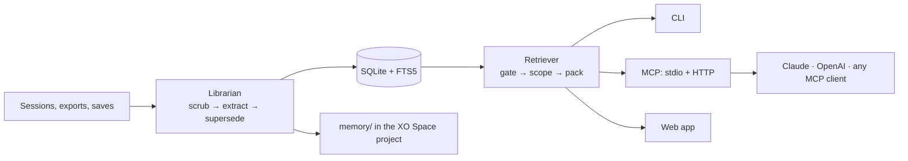
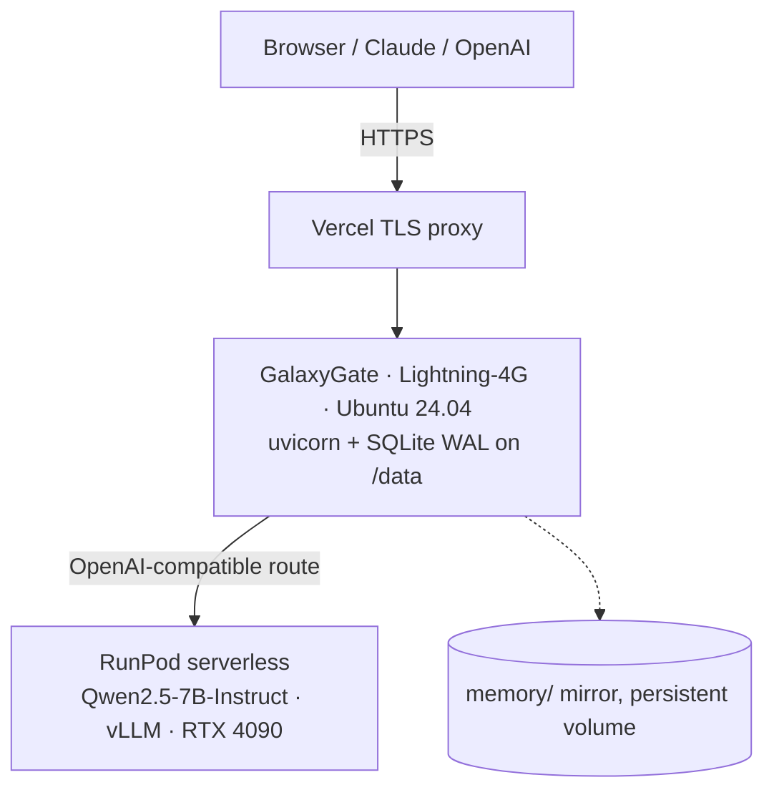

# Vault — Agentic Memory OS


<p align="center">
  
  
  
  
  
  
</p>

**Memory that follows you across every model and agent.**

Vault reads your AI conversations, turns them into durable facts about your projects and your life, and hands the smallest useful slice back to whatever model you use next. It runs on your laptop or on a server, writes into the `memory/` folder of an XO Space project so every run is visible, and never copies a chat into a shared folder.

Built at the Coffee & Code AI Agent Hackathon, Philadelphia — September 20, 2026.

---

## Try it

| | |
|---|---|
| **Live app** | http://216.146.3.8:8000/ — GalaxyGate server, extraction on RunPod |
| **Interactive demo** | https://vault-life-theta.vercel.app — 2,746 messages as one person's memory graph |
| **Remote MCP** | `https://vault-mcp-sepia.vercel.app/mcp` — attach Claude or OpenAI to the live store |

**60-second demo:** open the live app → paste any `## User` / `## Assistant` transcript containing a decision → press **Ingest** → watch it land in the memory graph → ask *"what did we decide?"* and read the context block it hands back.

---

## The problem

Every model forgets you. ChatGPT, Claude, Gemini, Cursor and Claude Code each keep their own memory, and none of them share. You re-explain your projects in every new session; agents repeat work they finished yesterday.

The usual fixes make it worse. Pasting everything costs thousands of tokens per prompt. Retrieval over raw chat logs pulls the wrong project, mixes in things you never wanted shared, and returns five versions of a fact that changed three times.

> **"Why not just use a SQL database?"**
> Because a database is a place to *put* facts — someone still has to decide what is worth writing, write it, and notice when it is superseded. That is the manual integration work. Vault took **2,746 messages → 115 durable facts in 0.47 s** with zero human curation, and kept `runtime = deno (was bun)` instead of silently overwriting. **The lineage is the product.**

## The solution

A librarian, not a filing cabinet. Vault structures memory at *write* time, so retrieval is a lookup instead of a search through noise.

1. **Capture** — Claude Code sessions, ChatGPT/Claude exports, Markdown transcripts, explicit saves. No keyboard hooks, no screen capture, ever.
2. **Librarian** — scrub secrets, extract facts/entities/an episode against a fixed JSON schema, resolve entities against a catalog, supersede stale facts instead of duplicating them.
3. **Store** — one SQLite file with FTS5, plus a Markdown mirror into the project's `memory/`.
4. **Retrieve** — a gate that skips memory when the prompt does not need it, a hard scope filter, a token-budget packer, and a log of exactly what was sent.
5. **Inject** — a CLI, an MCP server (stdio **and** HTTP), and a web app.

Two rules carry most of the value:

- **Supersession.** When a fact changes, the old row is marked superseded by the new one. `auth = sessions` becomes `auth = Clerk (was sessions, 2026-09-20)`. History is kept; only the current fact is injected.
- **Scope is a hard filter.** A chat scoped to one project never sees another project's facts. Finances and health never ride along with a project scope.



---

## What shipped

| Piece | Status |
| --- | --- |
| `vault ingest` — Claude Code jsonl, ChatGPT export, Markdown | ✅ |
| Facts, entities, episodes with supersession; SQLite + FTS5 | ✅ |
| Markdown mirror (semantic, episodic, procedural, working) | ✅ |
| `vault ask` — gate, scope filter, budget packer, injection log | ✅ |
| MCP over **stdio** — `vault_catalog`, `vault_search`, `vault_get`, `vault_remember` | ✅ |
| MCP over **HTTP** — same four tools, bearer-auth, for hosted clients | ✅ |
| `vault eval` on 25 golden prompts | ✅ |
| FastAPI app — `/`, `/ingest`, `/ask`, `/audit`, `/health`, `/catalog`, `/sources`, `/mcp` | ✅ |
| Memory-graph dashboard, redrawn after every ingest | ✅ |
| **GalaxyGate server + RunPod serverless endpoint, live** | ✅ |
| Connect-a-source: one-click import of local Claude Code sessions | ✅ |
| Offline provider so the whole demo runs with no key and no network | ✅ |
| RunPod embedding endpoint, hybrid search | Stretch |
| macOS hotkey, browser extension, encryption at rest | Roadmap |

---

## Hosted mode — what is actually running



| Component | Detail |
|---|---|
| Server | GalaxyGate Lightning-4G (2 vCPU / 4 GB), Ubuntu 24.04, `216.146.3.8` |
| Service | systemd → `uvicorn vault.web:app`, state on `/data` so redeploys keep memory |
| GPU | RunPod serverless `ya1p8cphzatokr` — worker-vllm v2.27.0, Qwen2.5-7B-Instruct |
| Scaling | min 0 / max 2 workers, FlashBoot, scales to zero between demos |
| Cold start | ~120 s first request; ~0.9 s warm |
| Secrets | `/etc/vault.env`, root-only `0600`. The browser never sees a key; only the server calls RunPod |

`/health` reports the active provider, endpoint reachability and latency, and returns **503** when the endpoint is unreachable — so it is a real uptime check, not decoration.

---

## Connect it to Claude and OpenAI

Vault speaks MCP over two transports at once, against the same store.

**Claude Code (local, stdio):**
```bash
claude mcp add vault -- "$(pwd)/.venv/bin/python" -m vault.mcp_server
```

**Claude Code (the hosted store, HTTP):**
```bash
claude mcp add --transport http vault-hosted https://vault-mcp-sepia.vercel.app/mcp \
  --header "Authorization: Bearer $VAULT_MCP_TOKEN"
```

**OpenAI (Responses API remote MCP):**
```json
{ "type": "mcp",
  "server_url": "https://vault-mcp-sepia.vercel.app/mcp",
  "headers": { "Authorization": "Bearer <VAULT_MCP_TOKEN>" } }
```

Same memory, two vendors, one store — which is the whole thesis.

> **On pulling chat history.** Claude Code sessions import in one click: they live in `~/.claude/projects` as jsonl and Vault parses them directly. **claude.ai and chatgpt.com chats cannot be pulled** — neither vendor exposes an API or OAuth scope for reading a user's conversations, so a "connect my account" button could only be a scraper driving a logged-in session. Vault uses the official export files instead, and the UI says so rather than pretending otherwise.

---

## Proof it works at scale

260 generated conversations across four life domains — work, contests, home, health — pushed through the real pipeline:

```
2,746 messages · 260 conversations  →  115 facts · 64 superseded · 22 entities   in 0.47 s
```

Then one scoped question:

```
[Vault context | scope: edge-scraper | 4 items | 94 tokens]
Profile: (none)
Facts (edge-scraper):
- runtime = deno (was bun, 2026-09-20)
```

**2,746 messages in, 94 tokens out** — and the agent is told what changed. Explore it at [vault-life-theta.vercel.app](https://vault-life-theta.vercel.app).

> *Honest footnote:* that volume run used `VAULT_PROVIDER=offline` (the deterministic rule-based provider) so it costs nothing and is reproducible. The five-transcript demo on the live app runs through **Qwen2.5-7B on RunPod**. Both are genuine pipeline output.

---

## Four bugs the deployment found that the tests did not

Running the thing is not the same as testing it. Each of these was invisible to a green suite:

| Bug | Why it mattered | Fix |
|---|---|---|
| **Supersession broke under a real LLM** | Qwen wrote predicate `auth method` in one transcript and `uses` in another, so the new decision sat *beside* the old one instead of replacing it. The headline demo was dead. The offline provider hid it — its regex emits a fixed predicate. | Pin predicates to attribute names in the shared system prompt |
| **A health fact reached the profile** | `sleep = badly` came back categorised `personal`, so nothing marked it sensitive and it rendered in the profile block — against safety §9. Model judgment was the only guard on a safety rule. | Deterministic keyword backstop over predicate, value **and** entity name |
| **Hot tier ate the token budget** | Only visible at volume: `profile.md` filled with 33 project decisions and spent its whole 300-token allowance, so a scoped ask cost **380 tokens with ~330 irrelevant**. | Project-entity facts are not identity — **380 → 94 tokens**, same answer |
| **Hex secrets were never redacted** | 16 symbols cap Shannon entropy at 4.0 bits/char; §9 requires *above* 4.0. So every 32/48/64-char hex token passed into `memory/`. **0 of 200** random tokens caught. | Dedicated hex rule with an entropy floor — **200 of 200** |

A fifth came from automated review: the MCP bearer token was compared with `==`, leaking it a character at a time via timing. Now `hmac.compare_digest`.

---

## Tech stack

| Layer | Choice | Why |
| --- | --- | --- |
| Language | Python 3.11 | Fast to build, easy to read |
| Extraction | Claude (`claude-sonnet-5`) locally · Qwen2.5-7B on RunPod vLLM hosted · deterministic `offline` provider for CI and demos | One JSON schema, swappable by one env var |
| Store | SQLite + FTS5, WAL | One file, portable, no server, two readers do not block |
| Retrieval | FTS5 bm25 → scope filter → budget packer | Cheap, explainable, testable |
| Agent interface | MCP — stdio (SDK) and HTTP (JSON-RPC 2.0) | Works with Claude, OpenAI, Cursor, any MCP client |
| Web | FastAPI, one inline HTML page, canvas graph | No build step, one file to deploy |
| Hosting | GalaxyGate + RunPod serverless + Vercel TLS | Judge-openable URL, GPU scales to zero |
| Quality | pytest, ruff, pinned requirements | 169 tests, clean lint |

Dependencies are pinned and deliberately few: `anthropic`, `pydantic`, `typer`, `mcp`, `fastapi`, `uvicorn`, `httpx`, `pytest`, `ruff`. MCP-over-HTTP is hand-rolled JSON-RPC rather than an SDK bump, because the pinned `mcp==1.0.0` ships stdio only and the wire format is plain JSON-RPC over POST.

---

## Quick start

```bash
git clone https://github.com/rhkrohan/vault.git && cd vault
python -m venv .venv && source .venv/bin/activate
pip install -r requirements.txt && pip install -e .
cp .env.example .env            # add ANTHROPIC_API_KEY (optional — see below)

vault ingest inbox/synthetic --project .
vault ask "what did we decide about auth?" --scope acme-platform
vault eval
vault serve-mcp
```

**No API key?** The whole demo runs offline:

```bash
export VAULT_PROVIDER=offline
vault ingest inbox/synthetic --project .   # 9 facts, 2 superseded, 5 episodes
vault ask "what did we decide about auth?" --scope acme-platform
```

It is not an extraction model and does not pretend to be one — it is a published set of regexes over the transcript conventions in `inbox/synthetic`, and it never invents a fact it did not match. It exists so tests, CI and a live demo never depend on a key.

**Run the web app:**
```bash
uvicorn vault.web:app --host 0.0.0.0 --port 8000
```

---

## Safety

Enforced in code, not just documented — see `SAFETY.md`.

- No keyboard hook, no screen recording, no HTTPS interception.
- No network calls except the configured model provider.
- No reads outside `inbox/`, `~/.claude/projects` and `VAULT_HOME`.
- **No chat content in `memory/`** — only extracted facts and evidence fragments under 120 characters. `tests/test_no_leaks.py` asserts no 12-word span from `inbox/` appears anywhere in `memory/`.
- `scrub.py` runs before any write: `sk-`/`sk-ant-`, AWS `AKIA`, GitHub `ghp_`, RunPod `rpa_`, JWTs, Luhn-valid card numbers, SSNs, long hex tokens, and high-entropy tokens.
- Finances and health are injected only when the prompt is about them, never inside a project scope.
- Every injection is logged with items sent, token count and target.

---

## Evaluation

```bash
vault eval          # writes eval/results.md
```

| Metric | Target | Result |
| --- | --- | --- |
| Gate accuracy | > 90% | **100.0%** |
| Recall@5 | > 80% | **92.3%** |
| Precision@5 | report | **56.4%** |
| Tokens injected, mean | report | **111** |
| Tokens injected, p95 | < 800 | **156** |
| Sensitivity leaks | zero | **zero** |
| 12-word transcript span in `memory/` | zero | **zero** |

Measured on the 25-row golden set against the five synthetic transcripts with `VAULT_PROVIDER=offline`.

---

## Repo map

```
src/vault/
  models.py db.py mirror.py      schema, SQLite + FTS5, Markdown mirror
  scrub.py extract.py supersede.py   the librarian
  ingest/                        claude_code · chatgpt · markdown
  retrieve/                      gate · scope · search · pack
  providers/                     base · claude · runpod · offline
  cli.py                         ingest · ask · eval · serve-mcp · export
  mcp_server.py mcp_http.py      MCP over stdio and over HTTP
  sources.py                     one-click import of local chat history
  web.py                         FastAPI app + dashboard
eval/  tests/  inbox/synthetic/  skill/vault/SKILL.md  deploy/
```

## Hackathon tracks

- **Quirq: Build It** — the librarian runs as Claude Code sessions inside an XO Space; the space shows sessions, files changed and costs.
- **Bring Your Own Agent** — the librarian decides its next step from model output: re-ask on invalid JSON, supersede on conflict, skip on low confidence.
- **The Code Registry** — pinned dependencies, no secrets, 169 tests, ruff clean.
- **GalaxyGate + RunPod** — live hosted mode, GPU scaling to zero.

## Roadmap

- Embeddings + local reranker for hybrid search (RRF over bm25 + cosine)
- macOS on-demand hotkey insert into any text field
- Browser extension scoped to AI sites
- Local extraction model (3B–8B) by default, cloud opt-in
- Encryption at rest with the key in the OS keychain

## Team

- Mubashir Panjwani
- Muhammad Rohan Khan
- Ibrahim Raheel

## License

MIT
